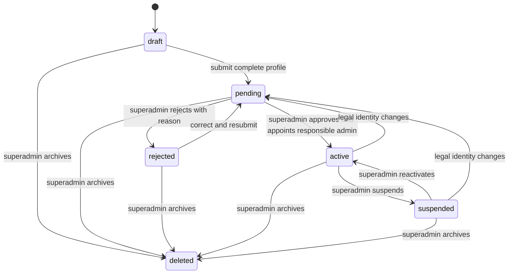

# Organizations module

Status: organization management and onboarding implemented. Updated: 2026-10-08. Architecture: [DESIGN](../DESIGN.md). Permissions: [Authorization](authorization.md).

## Purpose and boundaries

Organizations owns business/adoption entity profiles, onboarding decisions, operational status, responsible administrators, memberships and immutable audit. Users owns account identity, verification, status and global roles. Organizations accesses it only through the public UsersDirectory port. Authorization consumes OrganizationAccess to resolve current membership and organization state. Approval means operational eligibility in Pettly; it does not certify licenses, professional qualifications, legal documents or individual services.

The feature follows hexagonal DDD: Organization aggregate and profile value validation; framework-free commands, queries, handlers and input/output ports; separate strict Zod request/response DTOs; explicit HTTP/persistence mappers; transactional Prisma adapter; Nest composition root. Other features must consume public ports rather than access Organizations tables directly.

Legal-document uploads, license-validation providers, customer-facing directory, product listings, payments, services and adoption publications are not implemented in this module. Administrative review currently relies on the profile and the reviewer recording their decision and justification. File storage and verification policies need a separate implementation.

## Lifecycle and invariants



- A verified active user starts their own draft through `POST /api/organizations/requests`; it grants no roles. A superadmin can create a draft through `POST /api/organizations` without an applicant or membership.
- Submission requires legalName, registrationNumber, email, phone, countryCode, city and address. Drafts and rejected requests can be corrected by the applicant or organization administrator. Pending and suspended profiles can be edited only by superadmin.
- Only superadmin approves, rejects, suspends, reactivates, transfers responsibility, archives or assigns/removes any membership role. Approval requires an explicitly selected active verified account and atomically assigns its matching administrator role. No account becomes a company/refuge administrator by requesting onboarding.
- Changes to legalName, registrationNumber or countryCode on an active or suspended organization return it to pending review. Contact/display updates preserve its state. Required operational profile fields cannot be cleared while active, pending or suspended.
- Only active organizations provide operational permissions. Suspension, rejection, renewed review and archive remove those permissions on the next server authorization check; existing user sessions remain usable for personal account access. Business/adoption capability separation also applies to superadmin in organization context.
- Responsible membership cannot be removed or demoted while active/suspended; transfer responsibility first. The selected responsible account must be active and verified at approval, transfer and reactivation. Account suspension/deletion still blocks that account across all organizations; it does not automatically suspend organizations or other members. A superadmin can transfer responsibility when the previous account is unavailable.
- Mutation bodies require the current positive `expectedVersion`. A stale version returns 409. Actual profile/state changes increment it once; membership changes have their own timestamps and do not increment it. Unchanged profile/status writes preserve version and audit count. Repeated archive is an idempotent no-op after superadmin authorization.
- Archive is terminal. It clears legal/contact/display data, retains UUIDs, lifecycle timestamps, relations, memberships and audit, and excludes the organization from own lists and operational access. Only superadmin can inspect archived records. Historical audit reasons are retained; archive is not an audit erasure procedure.

## Data and update timing

All identifiers are UUIDs; timestamps are UTC. Migration `202610080006_organization_lifecycle` adds profile/lifecycle fields. Existing organizations become drafts, never automatically approved.

### organizations

| Field                                | Purpose, validation and updates                                                                                                                                                                                                                    |
| ------------------------------------ | -------------------------------------------------------------------------------------------------------------------------------------------------------------------------------------------------------------------------------------------------- |
| id                                   | Immutable UUID generated on creation.                                                                                                                                                                                                              |
| name                                 | Display name, trimmed 2–150 characters, no control characters. Updated through profile; archive replaces it with `Archived organization`.                                                                                                          |
| type                                 | Immutable business/adoption_entity discriminator; constrains memberships and capabilities.                                                                                                                                                         |
| status                               | draft/pending/active/rejected/suspended/deleted; changed only through lifecycle transitions.                                                                                                                                                       |
| version                              | Positive integer, starts at 1; incremented on real profile/lifecycle changes.                                                                                                                                                                      |
| legalName                            | Optional in drafts; required before review, 2–150 characters. Legal changes require renewed approval.                                                                                                                                              |
| registrationNumber                   | Optional in drafts; required before review. Uppercase canonical alphanumeric 2–40 characters after removing spaces, dots, hyphens and slashes. Unique with countryCode. This is formatting and uniqueness validation, not legal validity checking. |
| description                          | Optional 1–2000 characters; null clears it.                                                                                                                                                                                                        |
| email                                | Organization contact, normalized lowercase, maximum 254; required before review. Separate from responsible user's verified login email. Organization contact ownership is not verified by this workflow.                                           |
| phone                                | E.164, 7–15 digits with leading `+`; required before review. No SMS verification yet.                                                                                                                                                              |
| website                              | Optional HTTPS URL without credentials, maximum 2048; never fetched by the API.                                                                                                                                                                    |
| countryCode                          | Uppercase ISO 3166-1 alpha-2 code; required before review; legal changes require renewed approval.                                                                                                                                                 |
| region, city                         | Optional 1–100 characters; city required before review.                                                                                                                                                                                            |
| address, addressLine2                | 1–200 characters; address required before review, second line optional.                                                                                                                                                                            |
| postalCode                           | Optional 1–20 characters, country-neutral.                                                                                                                                                                                                         |
| applicantId                          | Nullable user UUID, set only by self-onboarding and immutable. Grants private draft/pending/rejected application access, not an organization role.                                                                                                 |
| responsibleUserId                    | Nullable until approval; explicitly selected by superadmin on approval/transfer.                                                                                                                                                                   |
| submittedAt                          | Latest initial/resubmission or legal-change review timestamp.                                                                                                                                                                                      |
| reviewedAt, reviewedBy, reviewReason | Latest review decision time, reviewer UUID and 10–500 character justification. Cleared on submission/renewed review; historical decisions remain in audit.                                                                                         |
| approvedAt                           | Most recent approval timestamp; retained through suspension and renewed review.                                                                                                                                                                    |
| suspendedAt                          | Set on suspension, cleared on activation, renewed review or archive.                                                                                                                                                                               |
| deletedAt                            | Set on terminal archive; null otherwise.                                                                                                                                                                                                           |
| createdAt, updatedAt                 | Creation time and latest real profile/lifecycle change; membership changes leave these unchanged.                                                                                                                                                  |

Contact/profile strings reject control characters; optional fields accept null except name. Database constraints back status/version, canonical registration/phone and required workflow fields. Country+registration uniqueness handles concurrent collisions. GIN pg_trgm indexes support display/legal name searches; scoped/time indexes support administrative and own lists. Registration uniqueness remains reserved while rejected/suspended; archive releases it by clearing the profile.

### organization_memberships

| Field                  | Purpose                                                                                           |
| ---------------------- | ------------------------------------------------------------------------------------------------- |
| id                     | UUID preserved on role replacement; reassignment after removal gets a new UUID.                   |
| organizationId, userId | Organization/user foreign keys; unique pair.                                                      |
| organizationType       | Internal discriminator backed by composite FK and role/type constraints; excluded from responses. |
| role                   | business_admin/business_operator or adoption_admin/adoption_operator. Only superadmin writes it.  |
| createdAt, updatedAt   | First assignment and latest real role replacement. Same-role request is a no-op.                  |

Memberships remain configured during suspension and archive. Removing one affects only that organization. User suspension blocks that user's access; reactivation leaves configured memberships intact. A deferred PostgreSQL constraint also prevents removing/demoting an approved organization's responsible administrator outside the API. Membership lists expose UUIDs/role/timestamps, not user contact data.

### organization_audit_entries

| Field                    | Purpose                                                                                                                                                         |
| ------------------------ | --------------------------------------------------------------------------------------------------------------------------------------------------------------- |
| id                       | Event UUID.                                                                                                                                                     |
| actorId                  | Authenticated actor UUID; applicant, organization administrator or superadmin depending on operation.                                                           |
| organizationId           | Affected organization UUID.                                                                                                                                     |
| targetUserId             | Membership/responsibility target UUID, null for other lifecycle changes.                                                                                        |
| action                   | organization.created/requested/profile_updated/submitted/approved/rejected/status_changed/responsible_changed/deleted or membership.role_assigned/role_removed. |
| previousValue, nextValue | State, role, organization type, responsibility UUID or the literal `profile`; private profile values are not copied into audit.                                 |
| reason                   | Administrative justification, 10–500 characters; self-onboarding uses a fixed initiation reason.                                                                |
| requestId, createdAt     | HTTP correlation UUID and UTC event time.                                                                                                                       |

Every real mutation and its audit are atomic. Append-only database triggers reject audit updates/deletes. IDs and foreign keys remain after account/organization logical deletion. Reasons are durable administrative records; avoid entering secrets or unnecessary personal information.

## HTTP contracts

Every endpoint requires a Bearer access token and active verified account. Strict Zod rejects unknown request/response fields. Basic responses contain `{ id, name, type, status, version, createdAt, updatedAt }`. Profile responses additionally contain profile/lifecycle fields above; private fields are never included in basic identity or list responses.

| Method/path under /api                           | Access and result                                                                                                             |
| ------------------------------------------------ | ----------------------------------------------------------------------------------------------------------------------------- |
| POST /organizations                              | Superadmin; `{name,type,profile?,reason}` → 201 draft basic identity.                                                         |
| POST /organizations/requests                     | Verified user; `{name,type,profile?}` → 201 own draft private profile; no role assignment.                                    |
| GET /organizations                               | Superadmin; search/status/type/countryCode filters → paged basic list.                                                        |
| GET /organizations/me                            | Own applicant/member organizations → paged basic list, always excludes deleted.                                               |
| GET /organizations/{id}                          | Own member, moderator or superadmin → basic identity; archived only superadmin.                                               |
| GET /organizations/{id}/profile                  | Superadmin, own administrator, or own applicant during draft/pending/rejected → private profile. Operators/moderators denied. |
| PATCH /organizations/{id}/profile                | Same profile access, state restrictions above; `{profile,reason,expectedVersion}` → 200 profile.                              |
| POST /organizations/{id}/submit                  | Applicant/administrator/superadmin; `{reason,expectedVersion}` → 201 pending profile.                                         |
| POST /organizations/{id}/approve                 | Superadmin; `{reason,expectedVersion,responsibleUserId}` → 201 active profile and responsible membership.                     |
| POST /organizations/{id}/reject                  | Superadmin; `{reason,expectedVersion}` → 201 rejected profile.                                                                |
| PATCH /organizations/{id}/status                 | Superadmin; `{status:"active"\|"suspended",reason,expectedVersion}` → 200 profile.                                            |
| PATCH /organizations/{id}/responsible            | Superadmin; `{responsibleUserId,reason,expectedVersion}` → 200 profile; old administrator membership retained.                |
| DELETE /organizations/{id}                       | Superadmin; JSON `{reason,expectedVersion}` → 200 `{message:"Organization archived."}`.                                       |
| GET /organizations/{id}/members                  | Own administrator or superadmin → paged membership list.                                                                      |
| GET /organizations/{id}/audit                    | Superadmin → paged immutable lifecycle/membership events.                                                                     |
| PUT /organizations/{id}/members/{userId}/role    | Superadmin; `{role,reason}` → 200 membership. Target must be active/verified, type-compatible.                                |
| DELETE /organizations/{id}/members/{userId}/role | Superadmin; JSON `{reason}` → 200 `{message:"Organization role removed."}`.                                                   |

All paginated endpoints accept page (default 1, max 100000) and limit (default 20, max 100). Organization lists accept search (1–100 characters, name/legal name/registration), status, type and countryCode; unknown/duplicate invalid query fields are rejected. Order is createdAt descending then UUID for lists/audit, createdAt ascending then UUID for memberships. Archived status filters never bypass own-list exclusion. Admin missing records return 404; unauthorized access returns 403 without granting access through another organization.

Other errors: 400 invalid UUID/body/profile/type; 401 missing/revoked authentication; 409 stale version, invalid transition, incomplete profile, duplicate registration or invalid responsible account; 429 rate limit; 503 dependency failure; safe 500 unexpected/audit failures. Approval/rejection action endpoints use Nest POST status 201; updates use 200.

Swagger: [Docker](http://localhost:3100/api/docs), [native](http://localhost:3000/api/docs). OpenAPI and all operation descriptions are English.

## Manual walkthrough

1. Register, verify email and log in. Start `POST /organizations/requests` with type business (or adoption_entity), name and the complete profile:

```json
{
  "name": "Mascotas Quindío",
  "type": "business",
  "profile": {
    "legalName": "Mascotas Quindío SAS",
    "registrationNumber": "900.123.456-7",
    "email": "contact@example.com",
    "phone": "+573001234567",
    "countryCode": "CO",
    "city": "Armenia",
    "address": "Calle 10 20"
  }
}
```

2. Submit with `{ "reason": "Organization profile ready for administrative review.", "expectedVersion": 1 }`. Applicant remains global user with no membership.
3. As superadmin, inspect `/profile`, approve at version 2 selecting the responsible user's UUID. Approval returns version 3 and assigns business_admin (adoption_admin for adoption_entity).
4. Check `/authorization/me` as responsible user. Assign an operator as superadmin; verify the operator can read basic identity but cannot read private profile, members or audit, approve requests, change status or assign roles.
5. Suspend at the current version; check that catalog/inventory/service permissions (or animals/adoptions permissions) disappear from `/authorization/me`. User login/personal profile remain available. Reactivate as superadmin.
6. Change legalName while active: status becomes pending and operations are blocked until another explicit approval. Try an old expectedVersion and expect 409.
7. Try removing/demoting the responsible member and expect 409. Transfer responsibility, then remove the old member if appropriate.
8. Search as superadmin, inspect `/audit`, archive and confirm `/organizations/me` excludes the record, private contact data is cleared and edits/restoration fail.

## Transactions, dependencies and verification

PostgreSQL is authoritative. This module does not cache permissions in Redis or JWT. Redis provides existing API rate limits; transactional Notifications handles organization/membership inbox and SMTP delivery. No registration/contact data is sent to external validation services.

Superadmin writes share `users:administration`, sorted actor/target user locks and organization lock. Profile/submission writes lock actor then organization. ExpectedVersion prevents silently overwriting another decision; unique indexes handle cross-organization registration races. Approval, responsible membership assignment and audit commit together; database deferred constraints evaluate final transaction state. Future operational handlers must lock `organization:{id}` inside their transaction, call the public Authorization port and enforce their own resource ownership to avoid racing suspension.

Tests cover the state machine, strict DTOs, privilege injection, incomplete submission, uniqueness, private/public projection, onboarding without roles, reject/resubmit, concurrent stale updates, audit rollback, responsible transfer/database guard, immediate permission filtering, type separation and terminal archive. The real-infrastructure suite uses isolated PostgreSQL/Redis/Mailpit, never the shared development database. See [development](development.md) for commands.

Latest validation: 19 unit tests and 28 real-infrastructure test results passed (27 HTTP scenarios plus the suite), with API/worker lint, typecheck, build, architecture boundaries and OpenAPI export. The OpenAPI contains 48 API operations, including 17 Organizations operations.

Local deployment verified: migration 006 is applied to the dedicated pettly_db on shared-network, both responsible-membership guards exist, API is healthy, worker is running, Swagger returns 200 and anonymous Organizations access returns 401. No real account roles or organization approvals were assigned during validation.

## Notifications integration — 2026-10-09

Lifecycle y cambios reales de membresía publican avisos mínimos a solicitante/responsable/miembro afectado según el evento, dentro de la transacción auditada. Correo de organización/acceso obligatorio; las preferencias opcionales no lo desactivan. Profile-only y membresía sin cambios no generan avisos. Event key de membresía usa UUID de su auditoría. Ver [Notifications](notifications.md).
